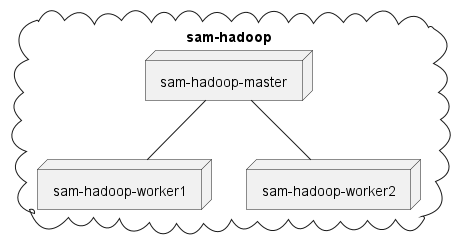

# 实验二 计算层软件架构（Hadoop部分）

2022春哈尔滨工业大学软件架构与中间件课程实验二共有一下三部分：

- Nginx集群负载均衡实验（必选）
- Hadoop分布式计算实验（必选）
- ActiveMQ异步消息推送实验（可选）

此分支为第二部分的代码。

## 目录

- [实验简介](#实验简介)
- [主要工作](#主要工作)
- [开发指南](#开发指南)
  - [文件目录说明](#文件目录说明)
  - [集群结构](#集群结构)
  - [Hadoop集群构建](#Hadoop集群构建)
  - [启动集群](#启动集群)
  - [WordCount](#WordCount)
- [使用的开源项目](#使用的开源项目)

## 实验简介

搭建1个master、2个worker节点的Hadoop集群环境，而后应用此环境实现：

1. 对[《飞鸟集》](https://en.wikisource.org/wiki/Stray_Birds)正文中每个单词的计数；

2. 模拟生成“进销存”系统的用户访问日志（1万个用户共100万次操作记录），并利用集群计算每个用户的访问次数。

## 主要工作

对[hadoop-cluster-docker](https://github.com/kiwenlau/hadoop-cluster-docker/)进行改进，实现基于Docker单机快速搭建[Hadoop3.2.3](https://hadoop.apache.org/release/3.2.3.html)集群（修改详见[使用的开源项目](#使用的开源项目)一节），帮助完成实验。

## 开发指南

### 文件目录说明

```
filetree 
│  generate_log.py  模拟生成进销存系统日志的脚本
│  LICENSE          授权协议
│  README.md        本文件
│
├─hadoop_docker      Hadoop单节点的镜像
│  │  buid-image.sh  构建镜像的脚本
│  │  Dockerfile     构建指令
│  │
│  └─config
│          workers          声明各worker
│          start-hadoop.sh  启动Hadoop
│          wc-hadoop.sh     启动Hadoop示例程序WordCount
│          ...
│
├─input_bak             实验中用到的输入文件
│      psi.log          生成的进销存系统访问日志
│      stray-birds.txt  飞鸟集正文
│
├─result                   运行结果
│      stray-birds-wc.txt  飞鸟集统计结果
│      user-access-wc.txt  用户访问统计结果
│
└─run_cluster            启动Hadoop集群相关文件
    │  start-cluster.sh  启动集群脚本
    │
    ├─input              输入文件夹，将被映射至容器中
    └─output             输出文件夹，将被映射至容器中
```

### 集群结构



如图所示的1个master和2个worker，共同工作在`sam-hadoop`网络下。

### Hadoop集群构建

#### 构建镜像和配置集群

如果你的运行平台为`linux/amd64`且暂不做任何修改，可以直接使用构建好的镜像后跳过[构建镜像和配置集群](#构建镜像和配置集群)一节：

```sh
docker pull jiabh/sam-hadoop:0.1
```

接下来介绍如何手动构建，以及如果运行平台不同时需要做哪些修改。

##### 1. 进入`hadoop_docker`文件夹：

```sh
cd hadoop_docker
```

##### 2. 如果你的CPU是其它架构，则需要修改（以arm为例，其余类似）：

| 文件相对路径           | 修改内容                                               |
| ---------------------- | ------------------------------------------------------ |
| ./Dockerfile           | ENV JAVA_HOME=/usr/lib/jvm/java-8-openjdk-**armhf**    |
| ./config/hadoop-env.sh | export JAVA_HOME=/usr/lib/jvm/java-8-openjdk-**armhf** |

平台兼容问题是`apt`在安装JDK时不同架构的安装路径不同导致的，其余均无区别。我在本地测试结果的是以上值，如果有误则自己测试一下找到正确路径填上去即可。

##### 3. 如果你想改变worker节点的个数，则需要：

1. 在`config/workers`文件中按照类似格式增减节点；
2. 在[启动集群](#启动集群)时追加节点个数作为参数（例如5个worker节点：`./start-cluster.sh 5`）。

##### 4. 构建

```sh
./build-image.sh
```

构建完成后可以执行`docker image ls`看到构建好的镜像`jiabh/sam-hadoop:0.1`。

### 启动集群

创建集群网络：

```sh
docker network create --driver=bridge sam-hadoop
```

进入`run_cluster`文件夹，运行`start-cluster.sh`启动集群：

```sh
cd run_cluster
./start-cluster.sh
```

应得到类似如下的输出：

```
start sam-hadoop-master container...
start sam-hadoop-worker1 container...
start sam-hadoop-worker2 container...
```

运行完毕后返回master节点的bash，成功启动各容器节点。

最后在master容器中启动Hadoop集群：

```sh
./start-hadoop.sh
```

### WordCount

在启动容器时，`start-cluster.sh`脚本会将`run_cluster`文件夹下的`input`和`output`文件夹挂载到容器中。执行WordCount时将会从`input`下载入，结果输出到`output`中。

以飞鸟集为例，将`input_bak/stray-birds.txt`放入`run_cluster/input`中，然后在master容器中启动WordCount：

```sh
./wc-hadoop.sh
```

结果将输出至上文的`output`文件夹中，名为`wc-result.txt`。

## 使用的开源项目

### [hadoop-cluster-docker](https://github.com/kiwenlau/hadoop-cluster-docker/)

修改内容：

1. 将Hadoop版本从2.7.2升级至3.2.3。由于大版本升级，部分配置文件需要更改；
2. WordCount结果输出位置从`stdout`更改为`output/wc-result.txt`；
3. 修改部分sh脚本名称以方便实验。
